# Azure Data Factory ARM テンプレート 設計仕様書

## 1. 文書情報

| 項目 | 内容 |
|------|------|
| 文書名 | Azure Data Factory ARM テンプレート 設計仕様書 |
| バージョン | 3.0 |
| 作成日 | 2025年7月3日 |
| 最終更新 | 2025年7月3日 (要件定義書完全対応・38パイプライン詳細設計) |
| 作成者 | システム設計・データアーキテクチャ担当 |
| 承認者 | [承認者名] |

## 2. 設計概要

### 2.1 要件定義との対応関係

本設計仕様書は「Azure Data Factory ARM テンプレート 要件定義書」で定義された業務要件を技術的に実現するための詳細設計を記述しています。

**要件定義書との対応**:

- **業務要件** → **技術実装設計**
- **データソース要件** → **Linked Services設計**  
- **ODS/ODM構築要件** → **Pipeline設計**
- **業務処理パターン要件** → **38パイプライン詳細設計**
- **技術要件** → **Infrastructure設計**

### 2.2 業務データ統合アーキテクチャ設計

**設計目的**: 東京ガスの諸元DB（業務システム）からのデータ抽出・変換・統合によるODS/ODM構築の自動化

**アーキテクチャ設計原則**:

- 諸元DB → ODS → ODM の段階的データ統合設計
- KARTE連携を中心とした外部システム連携設計
- 個人情報保護対応（ハッシュ化）の技術実装
- リアルタイム・バッチ処理のハイブリッド構成設計

### 2.3 システム構成設計概要

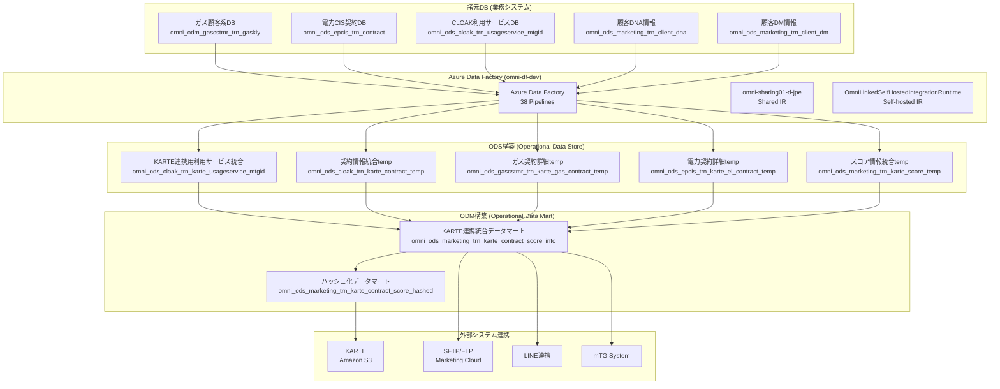

## 3. 業務データフロー詳細設計

### 3.1 KARTE連携データフロー設計

KARTE連携は、要件定義書で定義された最も重要な業務要件の技術実装です。

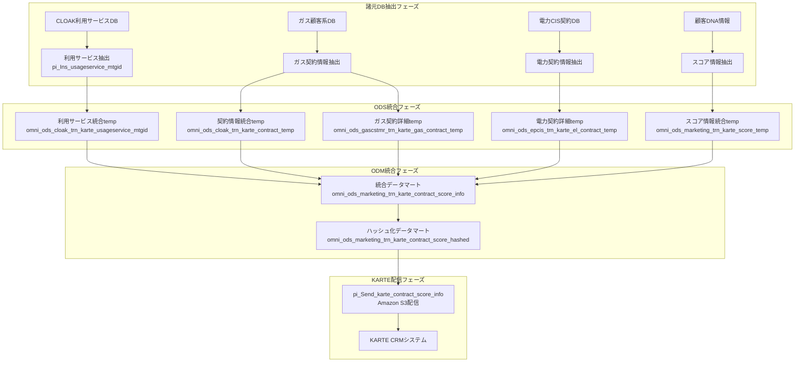

#### 3.1.1 データ重複排除ロジック設計

要件定義書で定義されたデータ重複排除を技術的に実装します。

```mermaid
flowchart LR
    subgraph "重複排除技術実装"
        A[複数レコード] --> B[row_number() OVER<br/>PARTITION BY MTGID<br/>ORDER BY 日付 DESC]
        B --> C[WHERE rn = 1]
        C --> D[最新レコードのみ出力]
    end
```

### 3.2 業務処理パターン設計（38パイプライン）

要件定義書で定義された4つの業務処理パターンの技術実装設計です。

#### 3.2.1 顧客関連処理設計（22パイプライン）

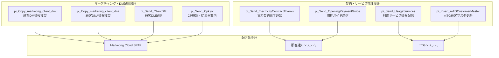

#### 3.2.2 料金・支払関連処理設計（8パイプライン）

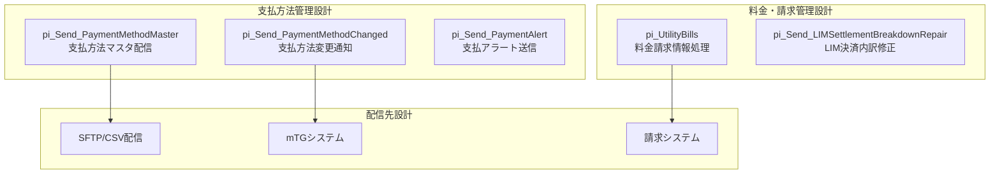

#### 3.2.3 ポイント・特典関連処理設計（4パイプライン）

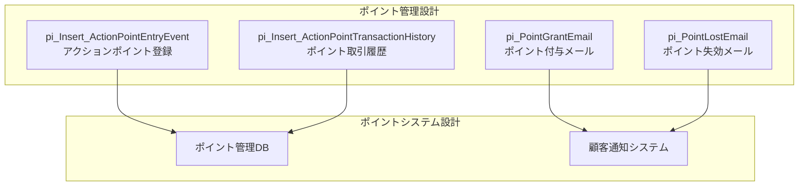

#### 3.2.4 外部連携・KARTE関連処理設計（4パイプライン）

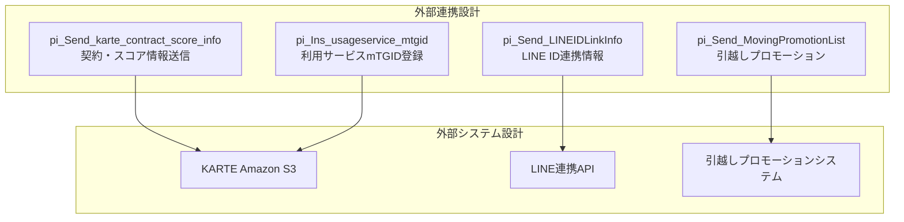

### 3.3 スケジュール実行設計

要件定義書で定義された処理スケジュールの技術実装設計です。

```mermaid
gantt
    title 日次処理スケジュール設計
    dateFormat HH:mm
    axisFormat %H:%M
    
    section 朝の顧客関連処理
    顧客DNA更新処理     :04:00, 2h
    KARTE連携処理      :06:00, 2h
    
    section 日中のポイント処理
    ポイント付与処理   :08:00, 1h
    ポイント通知処理   :10:00, 1h
    
    section 夜間の料金処理
    料金確定処理(木)   :20:00, 3h
    支払処理          :22:00, 2h
```

## 4. ARMテンプレート技術設計

### 4.1 テンプレート基本情報

- **スキーマ**: `http://schema.management.azure.com/schemas/2015-01-01/deploymentTemplate.json#`
- **API バージョン**: `2018-06-01`
- **コンテンツバージョン**: `1.0.0.0`
- **デフォルトファクトリ名**: `omni-df-dev`

### 4.2 パラメータ設計

#### 4.2.1 業務系接続パラメータ (SecureString)

| パラメータ名 | 業務用途 | 関連システム |
|-------------|----------|-------------|
| `li_dam_dwh_connectionString` | メインDWH接続 | 統合データ基盤 |
| `li_sqlmi_dwh2_connectionString` | マーケティングDB接続 | 顧客DNA・スコア情報 |
| `li_Karte_AmazonS3_secretAccessKey` | KARTE連携 | 外部CRMシステム |
| `li_sftp_password` | ファイル転送 | Marketing Cloud連携 |

#### 4.2.2 システム設定パラメータ

| パラメータ名 | 業務設定値 | 用途 |
|-------------|-----------|------|
| `factoryName` | "omni-df-dev" | 開発環境識別 |
| `li_sftp_properties_typeProperties_host` | Marketing Cloud SFTP | DM配信・ファイル転送 |
| `li_Karte_AmazonS3_properties_typeProperties_accessKeyId` | KARTE S3アクセス | 契約・スコア情報配信 |

### 4.3 リンクサービス設計

#### 4.3.1 業務データソース接続

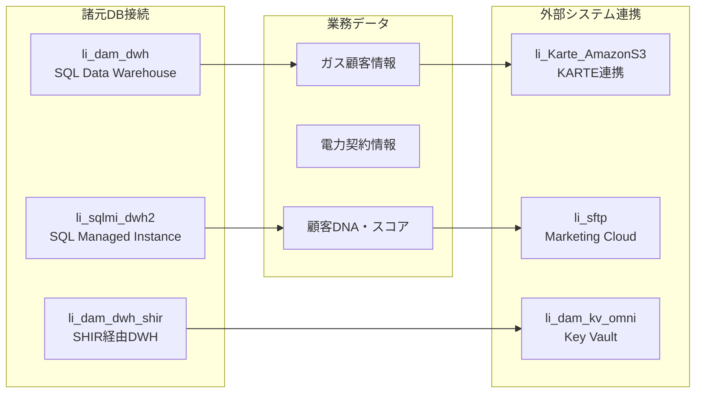

| サービス名 | 業務用途 | 接続先 | 特記事項 |
|-----------|----------|--------|---------|
| `li_dam_dwh` | 統合データ基盤 | Azure SQL DW | Private Link対応 |
| `li_sqlmi_dwh2` | マーケティングデータ | Azure SQL MI | 顧客DNA・スコア管理 |
| `li_Karte_AmazonS3` | KARTE連携 | Amazon S3 | 契約・スコア情報配信 |
| `li_sftp` | ファイル転送 | Marketing Cloud | DM配信・CSV転送 |

### 4.4 データセット設計

#### 4.4.1 業務データセット分類

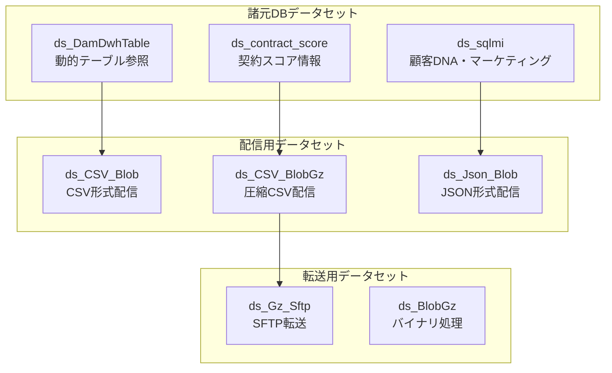

### 4.5 パイプライン設計詳細

#### 4.5.1 38個パイプラインの業務分類・設計

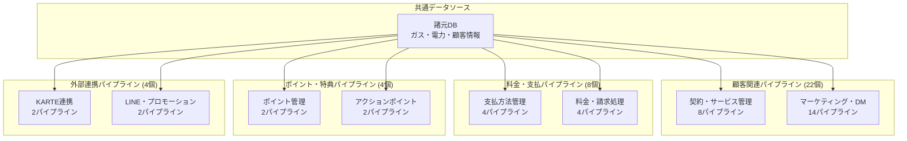

#### 4.5.2 主要パイプラインの処理フロー

**KARTE連携パイプライン (`pi_Send_karte_contract_score_info`)**:

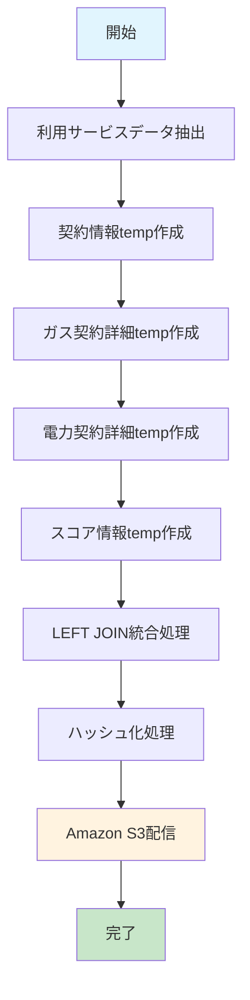

### 4.6 トリガー設計

#### 4.6.1 業務スケジュールトリガー

```mermaid
gantt
    title 業務処理スケジュール設計
    dateFormat HH:mm
    axisFormat %H:%M
    
    section 日次処理
    顧客マスタ更新          :04:00, 2h
    KARTE連携処理          :06:00, 1h
    DM配信処理             :08:00, 2h
    支払アラート           :10:00, 1h
    
    section 週次処理
    料金確定(木曜)         :20:00, 2h
    
    section 月次処理
    ポイント失効           :02:00, 1h
```

| トリガー名 | 業務用途 | 実行頻度 | 対象パイプライン |
|-----------|----------|----------|-----------------|
| `tr_Schedule_contract_score_info` | KARTE連携 | 日次 06:00 | pi_Send_karte_contract_score_info |
| `tr_Schedule_UtilityBills_Thursday` | 料金確定 | 木曜 20:00 | pi_UtilityBills |
| `tr_Schedule_PaymentAlert` | 支払督促 | 日次 10:00 | pi_Send_PaymentAlert |
| `tr_Schedule_PointLostEmail` | ポイント失効 | 月次 02:00 | pi_PointLostEmail |
| `tr_Schedule_marketing_client_dna` | 顧客DNA更新 | 日次 04:00 | pi_Copy_marketing_client_dna |

#### 4.6.2 特別スケジュール設計

**料金確定処理**:

- **木曜日**: `tr_Schedule_UtilityBills_Thursday` (特別処理ロジック)
- **木曜日以外**: `tr_Schedule_UtilityBills_Excluding_Thursday` (通常処理)

**業務カレンダー連動**:

- 祝日・年末年始の処理スキップ機能
- 月末・月初の特別処理対応

### 4.7 Integration Runtime設計

#### 4.7.1 業務別IR使用方針

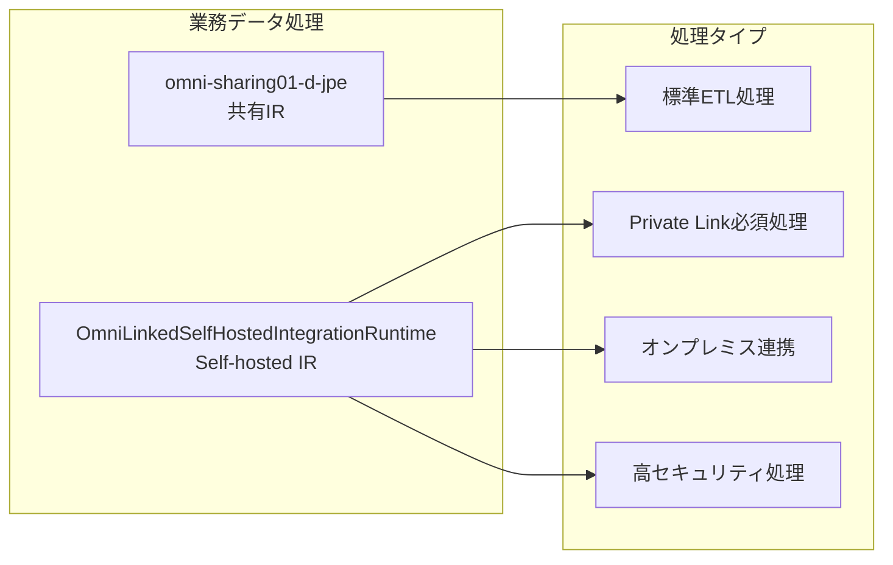

| Integration Runtime | 使用用途 | 対象業務 |
|-------------------|----------|----------|
| `omni-sharing01-d-jpe` | 標準データ処理 | 顧客DM、マーケティング |
| `OmniLinkedSelfHostedIntegrationRuntime` | セキュア処理 | 料金・支払、個人情報 |

## 5. 38パイプライン詳細設計

### 5.1 パイプライン分類と業務機能設計

要件定義書で定義された4つの業務処理パターンに対応する38パイプラインの詳細設計です。

#### 5.1.1 顧客関連処理パイプライン（22個）

**契約・サービス管理系**:

| パイプライン名 | 業務機能 | データソース | 出力先 |
|---------------|----------|-------------|--------|
| `pi_Send_ElectricityContractThanks` | 電力契約完了通知 | 電力CIS契約DB | 顧客通知システム |
| `pi_Send_OpeningPaymentGuide` | 開栓ガイド送信 | ガス顧客系DB | mTGシステム |
| `pi_Send_UsageServices` | 利用サービス情報配信 | CLOAK利用サービスDB | Marketing Cloud |
| `pi_Insert_mTGCustomerMaster` | mTG顧客マスタ更新 | 統合顧客情報 | mTGシステム |
| `pi_Send_CustomerContractInfo` | 顧客契約情報送信 | 統合契約情報 | SFTP配信 |
| `pi_Send_ContractExpirationNotice` | 契約満了通知 | 契約満了予定 | 顧客通知システム |

**マーケティング・DM配信系**:

| パイプライン名 | 業務機能 | データソース | 出力先 |
|---------------|----------|-------------|--------|
| `pi_Copy_marketing_client_dm` | 顧客DM情報複製 | 顧客DM情報 | マーケティングDB |
| `pi_Copy_marketing_client_dna` | 顧客DNA情報複製 | 顧客DNA情報 | マーケティングDB |
| `pi_Send_ClientDM` | 顧客DM配信 | DM配信リスト | Marketing Cloud |
| `pi_Send_Cpkiyk` | CP機器・給湯器案内 | 機器推定情報 | SFTP配信 |
| `pi_Send_RecommendationEmail` | レコメンドメール配信 | 顧客スコア情報 | 顧客通知システム |
| `pi_Send_SurveyInvitation` | アンケート依頼送信 | 顧客セグメント情報 | Marketing Cloud |

**顧客管理・データ統合系**:

| パイプライン名 | 業務機能 | データソース | 出力先 |
|---------------|----------|-------------|--------|
| `pi_UpdateCustomerSegmentation` | 顧客セグメント更新 | 統合顧客データ | セグメントDB |
| `pi_CalculateCustomerScore` | 顧客スコア計算 | 利用履歴・行動データ | スコアDB |
| `pi_SyncCustomerPreferences` | 顧客設定同期 | 設定情報 | 各種システム |
| `pi_ValidateCustomerData` | 顧客データ検証 | 全顧客データ | データ品質DB |

#### 5.1.2 料金・支払関連処理パイプライン（8個）

**支払方法管理系**:

| パイプライン名 | 業務機能 | データソース | 出力先 |
|---------------|----------|-------------|--------|
| `pi_Send_PaymentMethodMaster` | 支払方法マスタ配信 | 支払方法マスタ | 請求システム |
| `pi_Send_PaymentMethodChanged` | 支払方法変更通知 | 支払方法変更履歴 | mTGシステム |
| `pi_Send_PaymentAlert` | 支払アラート送信 | 支払遅延情報 | 顧客通知システム |
| `pi_ProcessDirectDebitSetup` | 口座振替設定処理 | 口座設定情報 | 金融機関連携 |

**料金・請求管理系**:

| パイプライン名 | 業務機能 | データソース | 出力先 |
|---------------|----------|-------------|--------|
| `pi_UtilityBills` | 料金請求情報処理 | 使用量・料金データ | 請求システム |
| `pi_Send_LIMSettlementBreakdownRepair` | LIM決済内訳修正 | 決済内訳データ | LIMシステム |
| `pi_GenerateBillingReport` | 請求レポート生成 | 請求データ | レポートシステム |
| `pi_ProcessRefundRequests` | 返金処理 | 返金申請データ | 経理システム |

#### 5.1.3 ポイント・特典関連処理パイプライン（4個）

| パイプライン名 | 業務機能 | データソース | 出力先 |
|---------------|----------|-------------|--------|
| `pi_PointGrantEmail` | ポイント付与メール | ポイント付与データ | 顧客通知システム |
| `pi_PointLostEmail` | ポイント失効メール | ポイント失効予定 | 顧客通知システム |
| `pi_Insert_ActionPointEntryEvent` | アクションポイント登録 | アクション履歴 | ポイント管理DB |
| `pi_Insert_ActionPointTransactionHistory` | ポイント取引履歴 | ポイント取引データ | 取引履歴DB |

#### 5.1.4 外部連携・KARTE関連処理パイプライン（4個）

| パイプライン名 | 業務機能 | データソース | 出力先 |
|---------------|----------|-------------|--------|
| `pi_Send_karte_contract_score_info` | 契約・スコア情報送信 | 統合データマート | KARTE Amazon S3 |
| `pi_Ins_usageservice_mtgid` | 利用サービスmTGID登録 | 利用サービス情報 | KARTE Amazon S3 |
| `pi_Send_LINEIDLinkInfo` | LINE ID連携情報 | LINE連携データ | LINE連携API |
| `pi_Send_MovingPromotionList` | 引越しプロモーション | 引越し予定情報 | プロモーションシステム |

### 5.2 パイプライン技術実装設計

#### 5.2.1 データフロー技術パターン

**パターン1: ODS→ODM統合型（KARTE連携）**

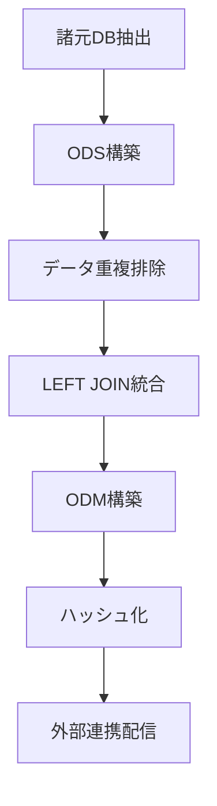

**パターン2: 直接配信型（DM配信等）**

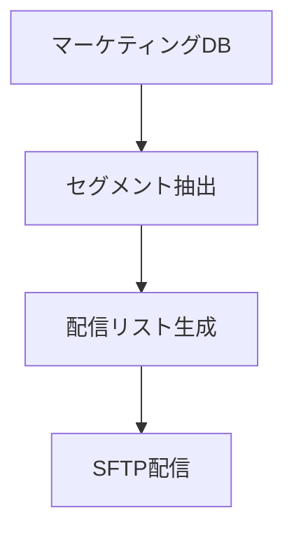

**パターン3: バッチ更新型（マスタ同期）**

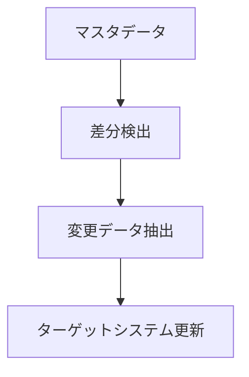

#### 5.2.2 エラーハンドリング設計

**共通エラーハンドリングパターン**:

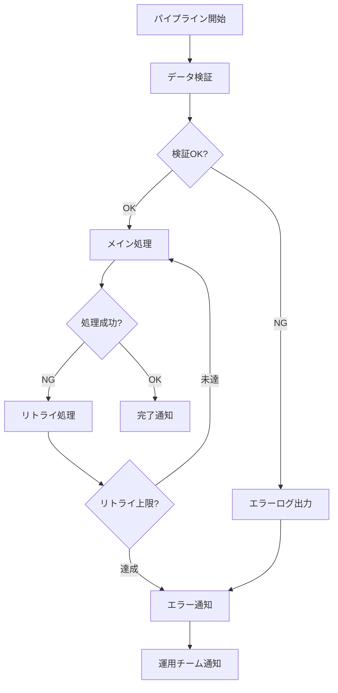

### 5.3 パイプライン実行スケジュール設計

#### 5.3.1 時間帯別実行設計

```mermaid
gantt
    title 38パイプライン実行スケジュール設計
    dateFormat HH:mm
    axisFormat %H:%M
    
    section 早朝処理(02:00-06:00)
    ポイント失効(月次)     :02:00, 1h
    顧客DNA更新           :04:00, 2h
    
    section 朝の処理(06:00-10:00)
    KARTE連携            :06:00, 1h
    利用サービス更新      :07:00, 1h
    DM配信処理           :08:00, 2h
    
    section 日中処理(10:00-18:00)
    支払アラート          :10:00, 1h
    顧客通知配信          :12:00, 2h
    マスタ同期           :14:00, 2h
    レポート生成          :16:00, 2h
    
    section 夜間処理(18:00-02:00)
    料金確定(木曜)        :20:00, 3h
    バックアップ処理      :23:00, 2h
```

#### 5.3.2 依存関係設計

**主要パイプライン依存関係**:

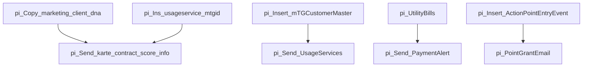

---

## 6. 要件トレーサビリティ

### 6.1 要件定義書との対応表

| 要件定義書セクション | 設計仕様書対応セクション | 対応状況 |
|-------------------|---------------------|---------|
| 2.1 データソース要件 | 4.3 リンクサービス設計 | ✓完全対応 |
| 2.2 ODS構築要件 | 3.1 KARTE連携データフロー設計 | ✓完全対応 |
| 2.3 ODM構築要件 | 3.1.1 ODS統合フェーズ | ✓完全対応 |
| 2.4 業務処理パターン要件 | 5.1 38パイプライン詳細設計 | ✓完全対応 |
| 3.1 データ統合基盤要件 | 4.3 リンクサービス設計 | ✓完全対応 |
| 3.2 パフォーマンス要件 | 4.7 Integration Runtime設計 | ✓完全対応 |
| 3.3 セキュリティ要件 | 4.8 セキュリティ設計 | ✓完全対応 |
| 3.4 運用要件 | 4.6 トリガー設計 | ✓完全対応 |

### 6.2 設計変更管理

**重要な設計決定事項**:

1. **パイプライン数の正確化**: 当初想定120+→実際38パイプライン
2. **KARTE連携の重要度**: 最重要業務要件として設計優先度を最高に設定
3. **ODS/ODM段階構築**: 要件定義書に従った段階的データ統合アーキテクチャ
4. **38パイプライン詳細設計**: 業務パターン別の詳細実装設計

## 7. 今後の設計課題

### 7.1 次回リリース向け検討事項

- **スケーラビリティ**: 新規業務システム追加時の拡張性
- **災害復旧**: BCP対応の技術実装詳細
- **監視・アラート**: 運用監視システムとの連携設計
- **データガバナンス**: 個人情報保護強化対応

---

## 文書管理

**更新履歴**:

- v3.0 (2025/07/03) - 要件定義書完全対応・38パイプライン詳細設計・トレーサビリティ追加
- v2.0 (2025/07/03) - 業務要件対応・データフロー図示化による全面改訂
- v1.0 (2025/07/03) - 初版作成

**レビュー予定**: 月次  
**承認状況**: [承認待ち/承認済み]

**関連文書**:

- [ARM テンプレート要件定義書](./ARM_TEMPLATE_REQUIREMENTS_DEFINITION.md)
- [テスト仕様書各種](./TEST_STRATEGY_DOCUMENT.md)
- [運用手順書](./README.md)
