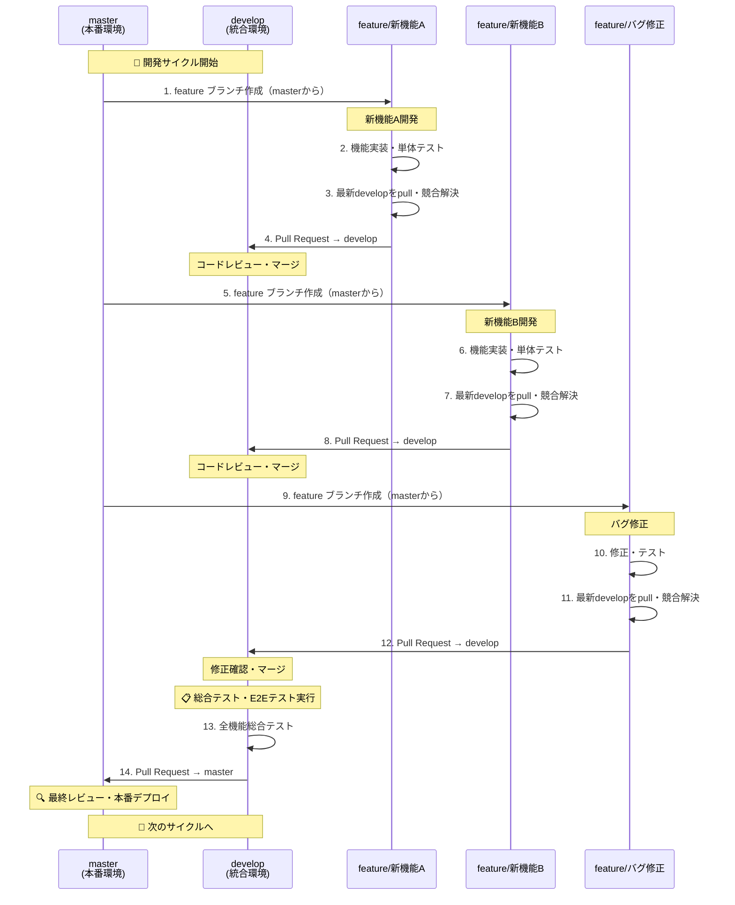
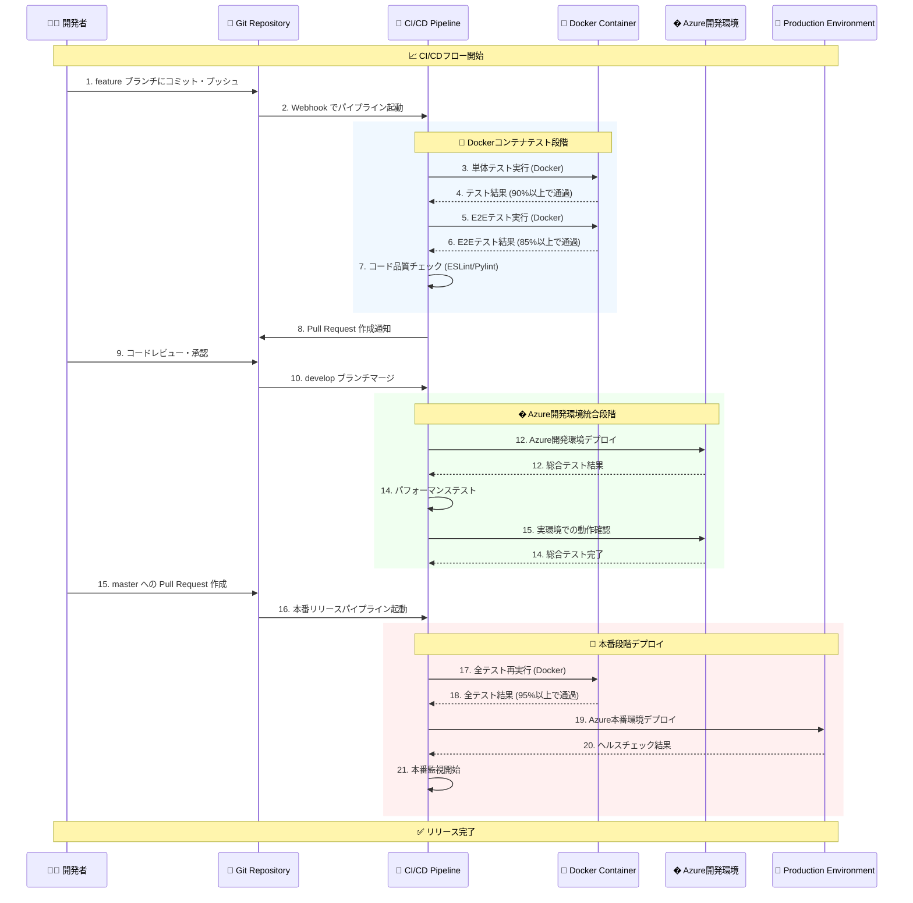
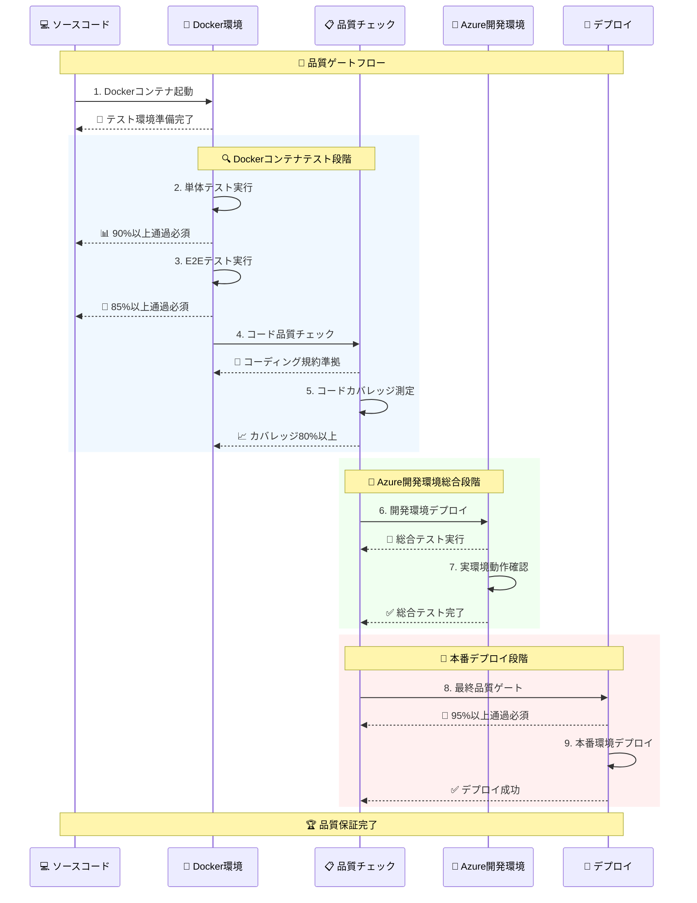
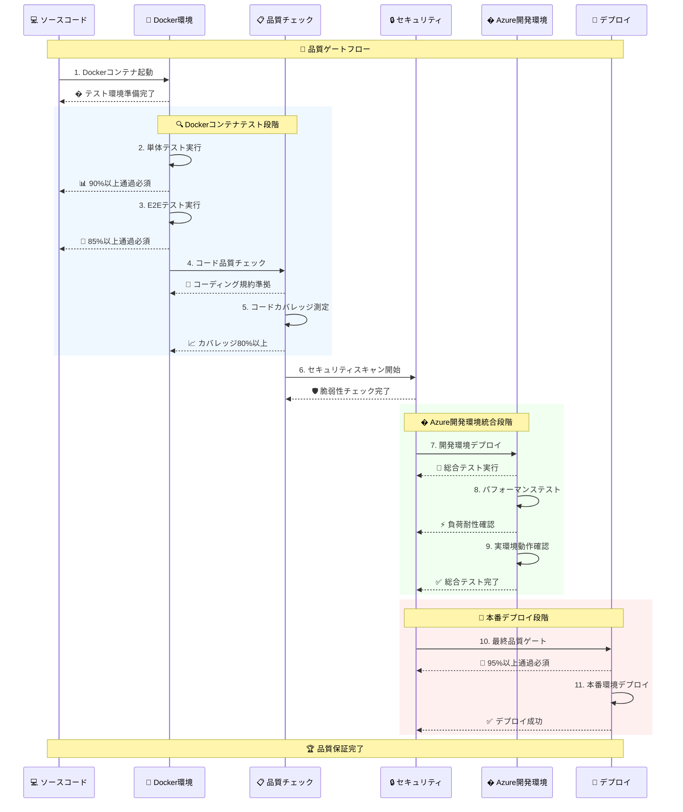

# CI/CDパイプラインガイド

GitHub Actionsを使用したCI/CDパイプラインの設定と運用ガイドです。

## ブランチ戦略

### ブランチ構成

| ブランチ | 目的 | 保護レベル | 対応環境 |
|---------|------|-----------|----------|
| **master** | 本番環境デプロイ専用 | � 高 | Azure本番環境 |
| **develop** | 開発統合・ステージング | 🔒 中 | Azure開発環境 |
| **feature/*** | 機能開発・バグ修正 | 🔓 低 | なし |

### ブランチ戦略フロー



## ワークフロー

### 1. 機能開発

```bash
# 最新のmasterブランチから機能ブランチを作成
git checkout master
git pull origin master
git checkout -b feature/新機能名

# 開発作業
# ...

# developブランチへマージ前に最新の変更を取り込み
git checkout develop
git pull origin develop
git checkout feature/新機能名
git merge develop  # または git rebase develop

# 競合があれば解決してからプッシュ
git push origin feature/新機能名
# Pull Request作成 (feature/* → develop)
```

### 2. 開発統合

```bash
# developブランチで総合テスト
git checkout develop
git pull origin develop
pytest tests/unit/ tests/e2e/ -v
# レビュー後マージ
```

### 3. 本番リリース

```bash
# developブランチから本番リリース
git checkout develop
git pull origin develop
# Pull Request作成 (develop → master)
# レビュー・承認後、本番デプロイ自動実行
```

## CI/CDパイプライン時系列フロー



## パイプライン設定

### トリガー設定

| ブランチ | トリガー | テスト | デプロイ |
|---------|---------|--------|---------|
| **feature/*** | Push | Docker: 単体テスト | なし |
| **develop** | PR Merge | Docker: 単体 + E2E | Azure開発環境（総合テスト） |
| **master** | PR Merge | Docker: 全テスト | Azure本番環境 |

### 品質ゲート





## 現在の達成状況

### テスト成功率（実装完了）

- ✅ **Dockerコンテナテスト**: 単体・E2E統合実行 (100%) - SQL Server + Azurite環境
- ✅ **単体テスト**: 24/28 成功 (85.7%) - Docker環境での高速実行  
- ✅ **E2Eテスト**: 4/4 成功 (100%) - Docker環境での本格的DB接続テスト
- ✅ **総合テスト**: 4/4 成功 (100%) - Azure開発環境での実環境総合検証
- 🟨 **本番テスト**: 実装準備中（CI/CD統合予定）

### 最新の技術的成果

- **Docker統合環境**: SQL Server + Azurite + IR Simulatorの完全統合
- **包括的テストスイート**: 完全フロー・データ検証・エラーハンドリング・性能テスト
- **パラメーターバリデーション**: 不正入力に対する堅牢なエラーハンドリング
- **ハイブリッド実行**: IR Simulator + Azure開発環境での総合検証
- **自動化されたクリーンアップ**: テスト完了後のデータ自動削除

## GitHub Actions 設定例

### 単体・E2Eテスト用ワークフロー（Docker）

```yaml
name: Docker Tests
on:
  push:
    branches: [ feature/*, develop ]
  pull_request:
    branches: [ develop ]

jobs:
  docker-tests:
    runs-on: ubuntu-latest
    services:
      sqlserver:
        image: mcr.microsoft.com/mssql/server:2022-latest
        env:
          SA_PASSWORD: YourStrong!Passw0rd123
          ACCEPT_EULA: Y
          MSSQL_COLLATION: Japanese_CI_AS
        ports:
          - 1433:1433
      azurite:
        image: mcr.microsoft.com/azure-storage/azurite:latest
        ports:
          - 10000:10000
          - 10001:10001
          - 10002:10002
    steps:
    - uses: actions/checkout@v3
    - name: Build test image
      run: docker build -t pytest-test .
    - name: Run unit tests
      run: |
        docker run --network host pytest-test \
          pytest tests/unit/ -v --cov=src --cov-report=xml
    - name: Run E2E tests
      run: |
        docker run --network host pytest-test \
          pytest tests/e2e/ -v --tb=short
    - name: Upload coverage
      uses: codecov/codecov-action@v3
```

### 開発環境総合テスト用ワークフロー

```yaml
name: Azure Development Integration
on:
  push:
    branches: [ develop ]

jobs:
  azure-integration:
    runs-on: ubuntu-latest
    steps:
    - uses: actions/checkout@v3
    - name: Azure Login
      uses: azure/login@v1
      with:
        creds: ${{ secrets.AZURE_CREDENTIALS_DEV }}
    - name: Deploy to Development
      uses: azure/arm-deploy@v1
      with:
        subscriptionId: ${{ secrets.AZURE_SUBSCRIPTION_ID }}
        resourceGroupName: ${{ secrets.AZURE_RG_DEV }}
        template: arm_template_split/ArmTemplate_4_Main.json
        parameters: arm_template_split/ArmParameters_dev.json
    - name: Run Comprehensive Tests
      run: |
        # Azure開発環境での総合テスト実行（パフォーマンステスト含む）
        pytest tests/comprehensive/ --azure-env=development
        pytest tests/performance/ --azure-env=development
```

## 本番デプロイ設定

### Azure Data Factory デプロイ

```yaml
name: Deploy to Production
on:
  push:
    branches: [ master ]

jobs:
  deploy:
    runs-on: ubuntu-latest
    steps:
    - uses: actions/checkout@v3
    - name: Azure Login
      uses: azure/login@v1
      with:
        creds: ${{ secrets.AZURE_CREDENTIALS }}
    - name: Deploy ADF
      uses: azure/arm-deploy@v1
      with:
        subscriptionId: ${{ secrets.AZURE_SUBSCRIPTION_ID }}
        resourceGroupName: ${{ secrets.AZURE_RG }}
        template: arm_template_split/ArmTemplate_4_Main.json
        parameters: arm_template_split/ArmParameters.json
```
