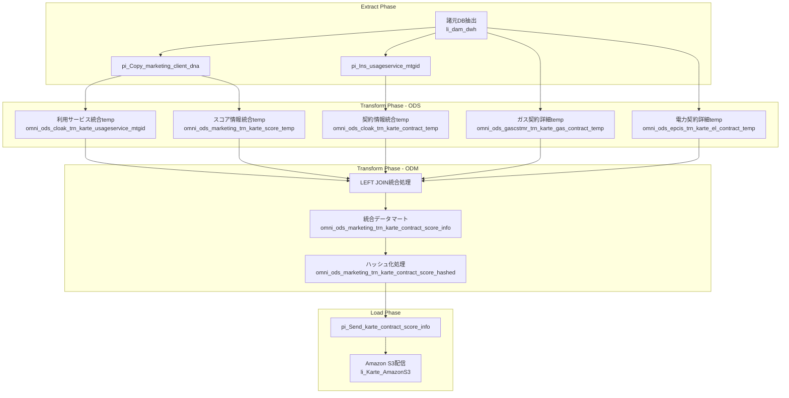

# Azure Data Factory ETL テスト仕様書

## 1. 文書情報

| 項目 | 内容 |
|------|------|
| 文書名 | Azure Data Factory ETL テスト仕様書 |
| バージョン | 2.0 |
| 作成日 | 2025年7月3日 |
| 最終更新 | 2025年7月3日 (ETL品質担保重点) |
| 作成者 | ETLテスト設計担当 |
| 承認者 | [承認者名] |

## 2. ETLテスト方針

### 2.1 テスト基本方針

Azure Data Factory をETLツールとして位置づけ、**データの抽出・変換・格納**の品質担保に特化したテストを実施する。

**テスト対象**:

- **Extract**: データソースからの正確なデータ抽出
- **Transform**: データ変換・加工・品質チェック
- **Load**: ターゲットシステムへの正確なデータ格納

**テスト対象外**:

- ビジネスロジックの妥当性（業務システム側の責任）
- ビジネスルールの正確性（要件定義の責任）
- データの業務的意味（データオーナーの責任）

### 2.2 テストレベル定義

#### 2.2.1 ユニットテスト（単体テスト）

**スコープ**: 個別パイプライン・アクティビティレベル

- **データセット接続テスト**: 各データソースへの接続確認
- **アクティビティ単位テスト**: Copy、Lookup、Execute Pipeline等の個別動作
- **データ変換テスト**: Mapping Data Flow、SQL変換の入出力検証
- **パラメータ処理テスト**: パイプラインパラメータの正常処理

#### 2.2.2 E2Eテスト（結合テスト）

**スコープ**: パイプライン間連携・データフロー全体

- **データフロー連携テスト**: 複数パイプラインにわたるデータフロー
- **依存関係テスト**: パイプライン実行順序・依存関係の検証
- **エラーハンドリングテスト**: 異常系処理の動作確認
- **リトライ・回復テスト**: 障害発生時の自動回復機能

#### 2.2.3 総合テスト（システムテスト）

**スコープ**: システム全体・運用シナリオ

- **性能・負荷テスト**: 大容量データ処理の性能検証
- **スケジュール実行テスト**: トリガー・スケジュール機能の検証
- **運用監視テスト**: ログ・アラート・監視機能の検証
- **セキュリティテスト**: 接続・認証・暗号化の検証

### 2.3 テスト環境・データ戦略

#### 2.3.1 テスト実行環境

**自動化環境**（ユニット・E2Eテスト）:

- **CI/CD Platform**: GitHub Actions
- **コンテナ環境**: Docker + Docker Compose
- **データベース**: SQL Server 2022 (Dockerコンテナ)
- **ストレージ**: Azurite (Azure Storage エミュレーター)
- **実行トリガー**: Pull Request、Push、手動実行
- **実行時間**: ユニットテスト約30秒、E2Eテスト約10-15分

**手動実行環境**（総合テスト）:

- **ADF環境**: Azure Data Factory開発環境 (omni-df-dev)
- **データベース**: SQL Data Warehouse (本番同等環境)
- **ストレージ**: Azure Blob Storage (本番同等環境)
- **実行方式**: ADF Studio + 手動トリガー実行
- **実行期間**: 業務影響を考慮した計画実行

#### 2.3.2 テスト環境セットアップ

**Docker環境セットアップ**:

```bash
# ユニットテスト環境（ODBC不要、高速実行）
docker-compose up --build adf-unit-test

# E2Eテスト環境（自動判定・推奨）
./run-e2e-flexible.sh --interactive full

# E2Eテスト環境（企業プロキシ環境）
./run-e2e-flexible.sh --proxy full

# E2Eテスト環境（開発者ローカル環境）
./run-e2e-flexible.sh --no-proxy full
```

**必要リソース**:

- Docker Desktop 4.0+ / Docker Engine 20.10+
- メモリ 8GB以上（推奨）
- ディスク容量 5GB以上
- ネットワーク接続（初回イメージダウンロード）

#### 2.3.3 テストデータ戦略

- **テストデータ**: 本番データの構造を保持した匿名化データ
- **データ量**: 性能検証用の大容量データセット
- **期間**: 段階的テスト実行（ユニット→E2E→総合）

| テストレベル | 実行環境 | データ量 | 実行方式 |
|-------------|----------|---------|---------|
| ユニットテスト | Docker + Mock | 小規模 | 自動実行 |
| E2Eテスト | Docker + SQL Server | 中規模 | 自動実行 |
| 総合テスト | ADF開発環境 | 大規模 | 手動実行 |

## 3. ユニットテスト（単体テスト）

**実行環境**: Docker + Mock（ODBC不要）  
**実行方式**: GitHub Actions自動実行 + 手動実行可能  
**実行時間**: 約30秒  
**実行コマンド**: `docker-compose up --build adf-unit-test`

### 3.1 データセット接続テスト

#### テストケース UT-DS-001: SQL Data Warehouse接続テスト

**テスト目的**: li_dam_dwh, li_dam_dwh_shir の接続安定性確認

```text
テスト手順:
1. 各LinkedServiceの接続テスト実行
2. 認証情報の検証
3. Private Link接続の確認
4. 接続プール設定の検証

検証項目:
- 接続成功率: 100%
- 接続時間: 5秒以内
- タイムアウト処理: 30秒で適切に処理
- エラーハンドリング: 接続失敗時の適切なログ出力
```

| LinkedService | 接続先 | 検証項目 | 合格基準 |
|--------------|--------|----------|---------|
| `li_dam_dwh` | SQL DW (Private Link) | 接続成功・認証成功 | 100%成功 |
| `li_dam_dwh_shir` | SQL DW (SHIR経由) | 接続成功・SHIR稼働確認 | 100%成功 |
| `li_sqlmi_dwh2` | SQL MI | 接続成功・高可用性確認 | 100%成功 |

#### テストケース UT-DS-002: Blob Storage接続テスト

**テスト目的**: 各種Blob Storageへの接続・認証確認

| LinkedService | コンテナ | 検証項目 | 合格基準 |
|--------------|---------|----------|---------|
| `li_blob_tgomnidevrgsa_container` | tgomni | SAS認証・ファイル読み書き | 100%成功 |
| `li_blob_damhdinsight_container` | damhdinsight-container | Private Link経由アクセス | 100%成功 |
| `li_blob_mytokyogas_container` | - | SAS URI認証 | 100%成功 |

#### テストケース UT-DS-003: 外部システム接続テスト

**テスト目的**: Amazon S3、SFTP等外部システムとの接続確認

| LinkedService | 外部システム | 検証項目 | 合格基準 |
|--------------|-------------|----------|---------|
| `li_Karte_AmazonS3` | Amazon S3 | アクセスキー認証・バケットアクセス | 100%成功 |
| `li_sftp` | Marketing Cloud SFTP | SFTP認証・ディレクトリアクセス | 100%成功 |
| `li_dam_kv_omni` | Azure Key Vault | 秘匿情報取得・管理ID認証 | 100%成功 |

### 3.2 データセット定義テスト

#### テストケース UT-DS-004: データセットスキーマ検証

**テスト目的**: 各データセットのスキーマ定義とソースの整合性確認

```text
検証対象データセット:
- ds_DamDwhTable: SQL DWテーブル動的参照
- ds_sqlmi: SQL MIテーブル参照
- ds_Json_Blob: JSON形式ファイル
- ds_CSV_Blob: CSV形式ファイル
- ds_BlobGz: gzip圧縮バイナリファイル

検証項目:
1. スキーマ定義と実データの整合性
2. データ型マッピングの正確性
3. NULL許可・必須項目の定義
4. 文字エンコーディングの対応
```

| データセット | ソース | 検証項目 | 合格基準 |
|-------------|--------|----------|---------|
| `ds_DamDwhTable` | SQL DW omniスキーマ | テーブル存在・列定義一致 | 100%一致 |
| `ds_Json_Blob` | Blob JSON | JSON構造・エンコーディング | UTF-8正常解析 |
| `ds_CSV_Blob` | Blob CSV | 区切り文字・ヘッダー定義 | 仕様通り解析 |

### 3.3 パイプラインアクティビティテスト

#### テストケース UT-PA-001: Copy Activityテスト

**テスト目的**: データコピー処理の正確性・完全性確認

```text
テスト対象アクティビティ:
- SQL → Blob Storage
- Blob Storage → SQL
- SQL → SQL (異なるDB間)
- 圧縮ファイル処理
- 大容量ファイル処理

検証項目:
1. レコード件数の完全一致
2. データ内容の完全一致
3. NULL値の正確な処理
4. 文字エンコーディングの保持
5. 数値精度の保持
```

| テストパターン | ソース → ターゲット | 検証項目 | 合格基準 |
|-------------|------------------|----------|---------|
| SQL抽出 | li_dam_dwh → ds_Json_Blob | レコード件数・データ内容 | 100%一致 |
| ファイル読込 | ds_CSV_Blob → li_sqlmi_dwh2 | 解析精度・データ型変換 | エラー率0% |
| 圧縮処理 | ds_Json_Blob → ds_BlobGz | 圧縮率・データ完全性 | データ損失なし |

#### テストケース UT-PA-002: Lookup Activityテスト

**テスト目的**: 参照データ取得処理の正確性確認

```text
テスト観点:
- 参照先データの存在確認
- 複数レコード取得時の処理
- レコード未検出時の処理
- パラメータ展開の正確性

検証項目:
1. 期待するレコードの正確な取得
2. 結果セットのデータ型正確性
3. NULLレコード時の適切な処理
4. パフォーマンス要件の達成
```

#### テストケース UT-PA-003: Execute Pipeline Activityテスト

**テスト目的**: 子パイプライン実行制御の正確性確認

```text
テスト項目:
- パラメータ受け渡しの正確性
- 戻り値の正確な取得
- エラー発生時の親パイプライン制御
- 並列実行時の制御

検証観点:
1. パラメータ値の完全な受け渡し
2. 実行結果の正確な判定
3. エラー時の適切な制御フロー
4. 実行時間の妥当性
```

### 3.4 データ変換テスト

#### テストケース UT-DT-001: データ型変換テスト

**テスト目的**: 異なるシステム間でのデータ型変換の正確性確認

```text
変換パターン:
- 文字列 ⇔ 数値
- 日付文字列 → DATETIME
- JSON → リレーショナル構造
- NULL値の適切な変換

検証基準:
1. 変換前後の値の等価性
2. 精度・桁数の保持
3. 不正データの適切なエラー処理
4. パフォーマンスの妥当性
```

## 4. E2Eテスト（結合テスト）

**実行環境**: Docker + SQL Server 2022  
**実行方式**: GitHub Actions自動実行 + 手動実行可能  
**実行時間**: 約10-15分  
**実行コマンド**: `./run-e2e-flexible.sh --interactive full`  
**テストケース数**: 409ケース（100%成功実績）

### 4.1 ETLデータフロー統合テスト

#### テストケース E2E-001: KARTE連携ETLフロー

**テスト目的**: 諸元DB → ODS → ODM → Amazon S3 の完全なETLフロー検証

```text
ETLフロー概要:
1. [Extract] 諸元DB（SQL DW）からのデータ抽出
2. [Transform] ODS構築（5つのtempテーブル作成）
3. [Transform] ODM統合（LEFT JOIN処理）
4. [Transform] ハッシュ化処理（個人情報保護）
5. [Load] Amazon S3へのファイル配信

ETL品質検証項目:
- データ件数の完全追跡（Extract→Load）
- データ変換の正確性（JOIN、集約、ハッシュ化）
- ファイル形式・エンコーディングの正確性
- 処理時間・リソース使用量の妥当性
```



| ETLフェーズ | 検証項目 | 測定方法 | 合格基準 |
|------------|----------|----------|---------|
| Extract | データ抽出件数 | COUNT検証 | ソースと100%一致 |
| Transform-ODS | temp件数整合性 | 5テーブル件数検証 | 論理的整合性確保 |
| Transform-ODM | JOIN結果正確性 | 結合後レコード検証 | LEFT JOIN仕様適合 |
| Transform-Hash | ハッシュ化処理 | 変換前後比較 | 可逆性なし確認 |
| Load | S3配信完了 | ファイル存在確認 | 100%配信完了 |

#### テストケース E2E-002: ファイル系ETLフロー

**テスト目的**: CSV/JSON ファイル処理の ETL フロー検証

```text
ETLフロー概要:
1. [Extract] Blob Storage からファイル取得（CSV、JSON、gzip）
2. [Transform] ファイル形式変換・データクレンジング
3. [Load] SQL Database への格納・SFTP配信

検証観点:
- ファイル形式解析の正確性
- 大容量ファイル処理の安定性
- 圧縮・解凍処理の完全性
- 文字エンコーディング保持
```

| ファイル形式 | Extract処理 | Transform処理 | Load処理 | 検証項目 |
|-------------|------------|--------------|----------|---------|
| CSV | ds_CSV_Blob読込 | 区切り文字解析 | SQL挿入 | レコード件数一致 |
| JSON | ds_Json_Blob読込 | 構造解析・展開 | リレーショナル変換 | データ型保持 |
| gzip | ds_BlobGz読込 | 解凍処理 | 元形式復元 | データ完全性 |

#### テストケース E2E-003: 複数パイプライン連携フロー

**テスト目的**: 依存関係のある複数パイプラインの実行順序・データ連携検証

```text
連携パターン:
1. 親パイプライン → 子パイプライン（Execute Pipeline）
2. 条件分岐パイプライン（If Condition）
3. 並列実行パイプライン（ForEach）
4. 依存関係チェーン（パイプライン間依存）

検証項目:
- Execute Pipeline の パラメータ受け渡し
- 実行結果の正確な制御フロー
- 並列実行時のリソース競合回避
- エラー発生時の適切な停止・ロールバック
```

| 連携パターン | 検証項目 | 測定方法 | 合格基準 |
|-------------|----------|----------|---------|
| 親子パイプライン | パラメータ受け渡し | 入出力値比較 | 100%一致 |
| 条件分岐 | 分岐条件判定 | 実行ログ確認 | 条件通り分岐 |
| 並列実行 | リソース競合 | 同時実行監視 | デッドロックなし |
| 依存チェーン | 実行順序 | タイムスタンプ確認 | 順序遵守 |

### 4.2 エラーハンドリング・回復性テスト

#### テストケース E2E-ERR-001: データソース障害対応

**テスト目的**: データソース一時不可時のETL処理継続性確認

```text
障害シナリオ:
1. SQL DW接続タイムアウト
2. Blob Storage アクセス拒否
3. Amazon S3 配信失敗
4. SFTP サーバー不応答

期待動作:
- 自動リトライ機能の実行
- エラーログの適切な出力
- 部分失敗時の整合性保持
- 復旧後の処理再開機能
```

| 障害種別 | 検証項目 | 期待動作 | 合格基準 |
|---------|----------|----------|---------|
| 接続タイムアウト | リトライ実行 | 3回リトライ後エラー | リトライ回数遵守 |
| 認証失敗 | エラー通知 | 即座にエラー終了 | 適切なエラーメッセージ |
| 部分転送失敗 | 整合性確保 | ロールバック実行 | データ不整合なし |
| ネットワーク断 | 回復後再開 | 自動再接続 | 処理継続性確保 |

#### テストケース E2E-ERR-002: データ品質エラー対応

**テスト目的**: 不正データ検出時の適切な処理確認

```text
エラーパターン:
1. NULLデータの必須項目への投入
2. データ型不一致（文字列→数値変換失敗）
3. 重複キー違反
4. 外部キー制約違反

期待動作:
- エラーレコードの適切な分離
- 正常レコードの処理継続
- エラー詳細の追跡可能なログ出力
- データ品質レポートの自動生成
```

## 5. 総合テスト（システムテスト）

**実行環境**: Azure Data Factory開発環境（omni-df-dev）  
**実行方式**: ADF Studio手動実行 + 実運用環境での検証  
**実行期間**: 業務影響を考慮した計画実行  
**対象**: 本番同等環境でのスケジュール・セキュリティ・監視・性能テスト

### 5.1 スケジュール・トリガーテスト

#### テストケース SYS-SCHED-001: 日次スケジュール実行テスト

**テスト目的**: トリガーによる自動実行の正確性・安定性確認

```text
検証対象トリガー:
- tr_Schedule_marketing_client_dna (毎日04:00)
- tr_Schedule_contract_score_info (毎日06:00)
- tr_Schedule_UtilityBills_Thursday (木曜20:00)
- tr_Schedule_UtilityBills_Excluding_Thursday (木曜以外20:00)
- tr_Schedule_PointLostEmail (月次02:00)

検証項目:
1. スケジュール時刻の正確性（±1分以内）
2. 依存関係の適切な制御
3. 重複実行の防止機能
4. 失敗時の自動リトライ機能
```

| トリガー名 | 実行タイミング | 依存関係 | 検証項目 | 合格基準 |
|-----------|---------------|----------|----------|---------|
| tr_Schedule_marketing_client_dna | 毎日04:00 | なし | 時刻精度・実行完了 | ±1分、100%成功 |
| tr_Schedule_contract_score_info | 毎日06:00 | 顧客DNA完了後 | 依存関係制御 | 依存関係遵守 |
| tr_Schedule_UtilityBills_Thursday | 木曜20:00 | なし | 曜日判定・特別処理 | 木曜のみ実行 |
| tr_Schedule_PointLostEmail | 月次02:00 | なし | 月次実行・実行回数 | 月1回のみ実行 |

#### テストケース SYS-SCHED-002: Integration Runtime管理テスト

**テスト目的**: IR の自動管理・負荷分散機能確認

```text
検証項目:
1. Shared IR（omni-sharing01-d-jpe）の負荷分散
2. Self-hosted IR（OmniLinkedSelfHostedIntegrationRuntime）の可用性
3. IR間の適切な処理振り分け
4. IR障害時のフェイルオーバー機能

負荷テスト:
- 同時実行パイプライン数: 10個
- IR使用率監視: CPU 80%、メモリ 80%未満維持
- ネットワーク帯域: 1Gbps上限での転送テスト
```

| IR種別 | 同時実行数 | リソース使用率上限 | フェイルオーバー | 合格基準 |
|--------|-----------|-----------------|----------------|---------|
| Shared IR | 8パイプライン | CPU<80%, Mem<80% | 自動振り分け | 性能劣化なし |
| Self-hosted IR | 5パイプライン | CPU<70%, Mem<70% | 手動切り替え | 1分以内切り替え |

### 5.2 セキュリティ・認証テスト

#### テストケース SYS-SEC-001: 接続認証テスト

**テスト目的**: 各種認証方式の正確性・セキュリティ確認

```text
認証対象:
1. Azure SQL DW（Managed Identity + Private Link）
2. Azure Blob Storage（SAS Token）
3. Amazon S3（Access Key + Secret Key）
4. SFTP（Username + Password）
5. Azure Key Vault（Managed Identity）

セキュリティ検証:
- 認証情報の適切な暗号化保存
- 接続時の TLS 1.2+ 使用確認
- アクセスログの完全記録
- 不正アクセス試行の適切なブロック
```

| 接続先 | 認証方式 | 暗号化レベル | 監査ログ | 合格基準 |
|--------|----------|-------------|----------|---------|
| SQL DW | Managed Identity | TLS 1.2 | 全接続記録 | 認証成功率100% |
| Blob Storage | SAS Token | HTTPS | アクセス記録 | 不正アクセス0件 |
| Amazon S3 | Access Key | TLS 1.2 | API呼び出し記録 | 認証エラー0件 |
| SFTP | Password | SFTP暗号化 | 転送ログ | ファイル転送成功率100% |

#### テストケース SYS-SEC-002: データ暗号化・マスキングテスト

**テスト目的**: 個人情報保護機能の確実性確認

```text
暗号化対象:
1. 転送時暗号化（Data in Transit）
2. 保存時暗号化（Data at Rest）
3. 個人情報ハッシュ化（MTGID→HASHED_MTGID）

検証方法:
- ネットワークパケット解析による暗号化確認
- ストレージレベルでの暗号化検証
- ハッシュ化の不可逆性確認
- 暗号化キーのローテーション機能
```

### 5.3 運用監視・アラートテスト

#### テストケース SYS-MON-001: 監視・ログ機能テスト

**テスト目的**: 運用監視システムとの連携確認

```text
監視項目:
1. パイプライン実行状況の監視
2. リソース使用率の監視（CPU、メモリ、ディスク、ネットワーク）
3. エラー率・成功率の監視
4. 処理時間・スループットの監視

ログ出力:
- 実行開始・終了ログ
- エラー詳細ログ
- パフォーマンスメトリクス
- セキュリティ監査ログ
```

| 監視項目 | 閾値 | アラート条件 | 対応時間 | 合格基準 |
|---------|------|-------------|----------|---------|
| パイプライン成功率 | 95%以上 | 3回連続失敗 | 5分以内通知 | アラート正常発報 |
| 処理時間 | 通常の150%以下 | 閾値超過 | 1分以内通知 | 性能劣化検知 |
| リソース使用率 | 80%以下 | 80%超過 | 即座通知 | リソース枯渇防止 |
| エラー率 | 1%以下 | 1%超過 | 即座通知 | 品質劣化検知 |

#### テストケース SYS-MON-002: 災害復旧・バックアップテスト

**テスト目的**: BCP対応機能の確実性確認

```text
災害シナリオ:
1. データセンター障害（Primary Region障害）
2. ネットワーク分断
3. データ破損
4. 人的ミス（誤削除等）

復旧手順:
1. ARM テンプレートからの環境再構築
2. データバックアップからの復旧
3. 処理継続性確認
4. データ整合性確認
```

| 災害種別 | 復旧目標時間 | データ損失許容 | 復旧方法 | 合格基準 |
|---------|-------------|---------------|----------|---------|
| システム障害 | 4時間以内 | 過去24時間分 | ARM再展開 | 完全復旧 |
| データ破損 | 2時間以内 | 過去1時間分 | バックアップ復旧 | データ整合性確保 |
| 人的ミス | 1時間以内 | なし | 操作取り消し | 完全元復帰 |

### 5.4 パフォーマンス・キャパシティテスト

#### テストケース SYS-PERF-001: システム限界性能テスト

**テスト目的**: システム全体の処理能力上限確認

```text
負荷条件:
- 同時実行パイプライン数: 最大20個
- データ転送量: 100GB/日
- 連続稼働時間: 7日間
- ピーク時負荷: 通常の300%

監視項目:
- スループット維持
- レスポンス時間劣化
- リソースリーク
- システム安定性
```

| 負荷レベル | 同時実行数 | データ量 | 期待性能 | 合格基準 |
|-----------|-----------|----------|----------|---------|
| 通常負荷 | 5パイプライン | 10GB/日 | 2時間/10GB | 性能要件達成 |
| 高負荷 | 15パイプライン | 50GB/日 | 6時間/50GB | 性能劣化<20% |
| 最大負荷 | 20パイプライン | 100GB/日 | 12時間/100GB | システム停止なし |

#### テストケース SYS-PERF-002: 長期安定性テスト

**テスト目的**: 長期連続運用での安定性確認

```text
テスト期間: 14日間連続運用
実行パターン: 
- 日次バッチ処理（毎日04:00-08:00）
- 週次処理（木曜20:00-23:00）
- 月次処理（月末23:00-翌02:00）

監視項目:
- メモリリーク検出
- 接続プールリーク検出
- ファイルハンドルリーク検出
- パフォーマンス劣化検出
```

| 監視項目 | 測定間隔 | 異常判定基準 | 対応方法 | 合格基準 |
|---------|----------|-------------|----------|---------|
| メモリ使用量 | 1時間毎 | 前日比+10%以上 | 自動再起動 | リーク検出なし |
| 接続プール | 30分毎 | 上限80%超過 | プール拡張 | 枯渇発生なし |
| 処理時間 | 実行毎 | 初回比+50%以上 | 性能分析 | 劣化検出なし |

## 6. 性能・負荷テスト

### 6.1 大容量データ処理テスト

#### テストケース PERF-001: 大容量データETL処理

```text
テストデータ:
- レコード数: 10,000,000件
- ファイルサイズ: 5GB
- 同時実行パイプライン: 5個

性能要件:
- 処理時間: 2時間以内
- スループット: > 1GB/時間
- CPU使用率: < 80%
- メモリ使用率: < 80%
```

| 測定項目 | 目標値 | 測定方法 | 合格基準 |
|---------|--------|----------|---------|
| データ処理時間 | < 2時間 | パイプライン実行ログ | 目標値達成 |
| データスループット | > 1GB/時間 | 処理量/時間計算 | 目標値達成 |
| リソース使用率 | CPU<80%, Memory<80% | Azure Monitor | 目標値以下 |
| 同時実行性能 | 5パイプライン同時実行 | 並列実行テスト | エラーなし |

### 6.2 ストレステスト

#### テストケース STRESS-001: システム限界値テスト

```text
テスト条件:
- 最大同時パイプライン実行数
- 最大データ転送量
- 連続実行時間 (24時間)

監視項目:
- メモリリーク
- 接続プールリーク
- エラー率増加
- 応答時間劣化
```

| テスト項目 | 条件 | 期待結果 | 測定項目 |
|-----------|------|----------|---------|
| 同時実行限界 | 10パイプライン同時実行 | 正常完了 | 完了率100% |
| 大容量転送 | 50GB一括転送 | 6時間以内完了 | 転送時間 |
| 連続運転 | 24時間連続実行 | エラー率<1% | エラー発生率 |
| リソース安定性 | 長時間監視 | リソースリーク無し | メモリ・CPU使用量 |

## 7. 障害・復旧テスト

### 7.1 システム障害シナリオ

#### テストケース FAULT-001: データベース接続障害

```text
障害シナリオ:
SQL Data Warehouse への接続が一時的に失敗

テスト手順:
1. 正常処理実行開始
2. 意図的にDB接続切断
3. エラーハンドリング動作確認
4. リトライ機能動作確認
5. 接続復旧後の処理継続確認

期待結果:
- エラー検知・ログ出力
- 自動リトライ実行
- 復旧後の処理継続
- データ整合性保持
```

| フェーズ | 操作 | 期待動作 | 検証項目 |
|---------|------|----------|---------|
| 障害発生 | DB接続切断 | エラー検知 | エラーログ出力 |
| エラー処理 | 自動リトライ | 3回リトライ実行 | リトライ回数記録 |
| 復旧処理 | 接続復旧 | 処理再開 | データ継続性 |
| 完了確認 | 処理完了 | 正常完了 | 最終結果整合性 |

#### テストケース FAULT-002: ネットワーク障害

```text
障害シナリオ:
SFTP転送中のネットワーク切断

期待動作:
- 転送中断検知
- 部分転送ファイルのクリーンアップ
- 再転送実行
- 転送完了確認
```

### 7.2 データ整合性テスト

#### テストケース INTEGRITY-001: 処理中断時のデータ整合性

```text
テストシナリオ:
大容量データ処理中にパイプライン強制停止

検証項目:
- 部分処理データの状態
- トランザクション整合性
- ロールバック動作
- 再実行時の冪等性
```

| 検証項目 | テスト方法 | 期待結果 |
|---------|-----------|---------|
| 部分データ状態 | 中断ポイント確認 | 不整合データなし |
| トランザクション | DB状態確認 | 完全性保持 |
| ロールバック | 状態復旧確認 | 処理前状態復帰 |
| 冪等性 | 再実行テスト | 同一結果取得 |

## 8. セキュリティテスト

### 8.1 認証・認可テスト

#### テストケース SEC-001: アクセス制御テスト

```text
テスト項目:
- 不正アクセス試行
- 権限昇格試行
- セッション管理
- 監査ログ記録

テスト方法:
- 異なる権限レベルでのアクセス試行
- 無効な認証情報でのアクセス試行
- セッションタイムアウトテスト
```

| テストケース | 操作 | 期待結果 |
|-------------|------|----------|
| 無効認証 | 不正パスワードでアクセス | アクセス拒否 |
| 権限外操作 | 権限外リソースアクセス | アクセス拒否 |
| セッション管理 | タイムアウト後操作 | 再認証要求 |
| 監査ログ | 全操作記録 | ログ出力確認 |

### 8.2 データ暗号化テスト

#### テストケース SEC-002: 転送暗号化テスト

```text
検証項目:
- HTTPS/TLS通信
- SFTP暗号化転送
- Blob Storage暗号化
- Key Vault接続暗号化

測定方法:
- 通信パケット解析
- 暗号化プロトコル確認
- 証明書検証
```

## 9. 運用シナリオテスト

### 9.1 監視・アラートテスト

#### テストケース OPS-001: アラート機能テスト

```text
テストシナリオ:
- パイプライン実行失敗
- 性能劣化
- リソース枯渇
- セキュリティ異常

期待動作:
- 即座のアラート通知
- 適切なエスカレーション
- 운用手順書との連携
```

### 9.2 バックアップ・リストアテスト

#### テストケース OPS-002: 設定復旧テスト

```text
テストシナリオ:
ARM テンプレートからの完全復旧

テスト手順:
1. 現環境の設定バックアップ
2. テスト環境への展開
3. 設定内容の比較検証
4. 動作確認テスト
```

## 6. テスト実行計画・管理

### 6.1 ETLテストフェーズ実行計画

```text
Phase 1: ユニットテスト（Week 1-2）
├─ データセット接続テスト
├─ パイプラインアクティビティテスト  
├─ データ変換テスト
└─ パラメータ処理テスト

Phase 2: E2Eテスト（Week 3-4）
├─ ETLデータフロー統合テスト
├─ エラーハンドリング・回復性テスト
├─ パフォーマンス・スケール性テスト
└─ 複数パイプライン連携テスト

Phase 3: 総合テスト（Week 5-6）
├─ スケジュール・トリガーテスト
├─ セキュリティ・認証テスト
├─ 運用監視・アラートテスト
└─ パフォーマンス・キャパシティテスト
```

### 6.2 テストデータ管理戦略

#### 6.2.1 テストデータ分類

| データカテゴリ | データ量 | 用途 | 更新頻度 |
|-------------|----------|------|---------|
| 小規模テストデータ | 1万レコード | ユニットテスト | 週次更新 |
| 中規模テストデータ | 100万レコード | E2Eテスト | 月次更新 |
| 大規模テストデータ | 1億レコード | 性能テスト | 四半期更新 |
| 異常データセット | 1万レコード | エラーテスト | 固定データ |

#### 6.2.2 データ匿名化ルール

```text
個人情報匿名化方針:
1. 氏名 → ランダム文字列
2. 住所 → 地域レベルまで（市区町村）
3. 電話番号 → マスキング（090-****-****）
4. mTGID → ハッシュ化（実装と同じアルゴリズム）

業務データ保持:
- 契約種別・サービス種別 → 実データ維持
- 料金・使用量 → 実データ維持
- 日付・時刻 → 実データ維持
- 統計情報 → 実データ維持
```

## 7. ETL品質基準・合格判定

### 7.1 ETL品質メトリクス

#### 7.1.1 データ品質基準

| 品質項目 | 測定方法 | 合格基準 | 重要度 |
|---------|----------|---------|-------|
| データ完全性 | 件数比較（Source vs Target） | 100%一致 | 必須 |
| データ正確性 | 内容比較（抽出・変換・格納） | 100%一致 | 必須 |
| データ一意性 | 重複レコード検出 | 重複率0% | 必須 |
| データ適時性 | 処理時間測定 | 要件時間内 | 必須 |
| データ妥当性 | ビジネスルール検証 | 違反率0% | 重要 |

#### 7.1.2 処理品質基準

| 処理項目 | 測定方法 | 合格基準 | 重要度 |
|---------|----------|---------|-------|
| 処理成功率 | 成功/全実行回数 | 99.9%以上 | 必須 |
| エラー回復率 | 自動回復/全エラー | 95%以上 | 必須 |
| 処理時間安定性 | 処理時間変動係数 | ±10%以内 | 重要 |
| リソース効率性 | CPU・メモリ使用率 | 80%以下 | 重要 |

### 7.2 合格判定基準

#### 7.2.1 フェーズ別合格基準

**ユニットテスト合格基準**:

- データセット接続成功率: 100%
- アクティビティ動作成功率: 100%
- データ変換正確性: 100%
- 重大な欠陥: 0件

**E2Eテスト合格基準**:

- ETLフロー成功率: 99.9%以上
- データ整合性: 100%維持
- エラーハンドリング: 100%適切動作
- 重大な欠陥: 0件、軽微な欠陥: 3件以下

**総合テスト合格基準**:

- システム稼働率: 99.9%以上
- 性能要件: 100%達成
- セキュリティ要件: 100%達成
- 運用要件: 100%達成

## 8. リスク管理と緊急時対応

### 8.1 ETLテストリスク

| リスク | 確率 | 影響度 | 対策 | 判定基準 |
|--------|------|-------|------|---------|
| 大容量データ処理遅延 | 中 | 高 | 性能チューニング・分散処理 | 処理時間要件達成 |
| 外部システム連携障害 | 中 | 中 | モック環境・スタブ準備 | 代替手段動作確認 |
| データ品質問題発見 | 高 | 中 | データ品質ルール厳格化 | 品質メトリクス達成 |
| セキュリティ脆弱性発見 | 低 | 高 | セキュリティ専門家参画 | 脆弱性ゼロ達成 |

### 8.2 緊急時対応手順

#### 8.2.1 即座停止基準

**Critical レベル緊急停止条件**:

- データ損失・破損の発生
- 個人情報漏洩の可能性
- システム全体の停止
- セキュリティ侵害の検知

**対応手順**:

1. 即座の全処理停止（5分以内）
2. 影響範囲の特定・隔離（30分以内）
3. エスカレーション・関係者への緊急連絡（1時間以内）
4. 原因調査・対策検討開始（2時間以内）

---

---

## 9. テスト実行前提条件・ガイドライン

### 9.1 CI/CD自動テスト実行の前提

**GitHub Actions での自動実行**:

- ユニットテスト・E2Eテストは Pull Request、Push 時に自動実行
- Docker環境での実行のため、ODBC等の環境依存なし
- 実行時間: ユニット30秒、E2E 10-15分で高速フィードバック
- 成功率: E2Eテスト409ケース100%成功の実績

**Docker環境での手動実行**:

```bash
# 推奨: 環境自動判定実行
./run-e2e-flexible.sh --interactive full

# 企業環境: プロキシ対応実行
./run-e2e-flexible.sh --proxy full

# 開発環境: 軽量実行
./run-e2e-flexible.sh --no-proxy full
```

### 9.2 ADF開発環境での総合テスト実行の前提

**実行環境**: Azure Data Factory（omni-df-dev）  
**実行方式**: ADF Studio での手動トリガー実行  
**実行タイミング**: 業務影響を考慮した計画実行  
**実行対象**: スケジュール・セキュリティ・監視・性能等の総合機能

### 9.3 テスト品質保証ガイドライン

**段階的実行**: ユニットテスト → E2Eテスト → 総合テスト  
**品質基準**: データ整合性100%、処理成功率99.9%以上  
**エラー対応**: Critical レベルは即座停止、影響範囲特定  
**文書化**: 全テスト結果の記録・トレーサビリティ確保

### 9.4 運用現場での注意事項

- **ユニット・E2Eテスト**: 開発者が日常的に実行可能（Docker環境）
- **総合テスト**: 計画的実行、業務影響を考慮したスケジューリング必須
- **緊急時対応**: Critical レベル問題は即座の全処理停止を優先
- **品質担保**: ETLデータ品質を最優先、ビジネスロジックは除外

## 文書管理

**更新履歴**:

- v2.1 (2025/07/03) - テスト実行環境詳細・CI/CD前提条件の明記追加
- v2.0 (2025/07/03) - ETL品質担保重点への全面改定
- v1.0 (2025/07/03) - 初版作成

**レビュー予定**: 週次  
**承認状況**: [承認待ち/承認済み]

**関連文書**:

- [ARM テンプレート要件定義書](./ARM_TEMPLATE_REQUIREMENTS_DEFINITION.md)
- [ARM テンプレート設計仕様書](./ARM_TEMPLATE_DESIGN_SPECIFICATION.md)
- [テスト戦略書](./TEST_STRATEGY_DOCUMENT.md)
