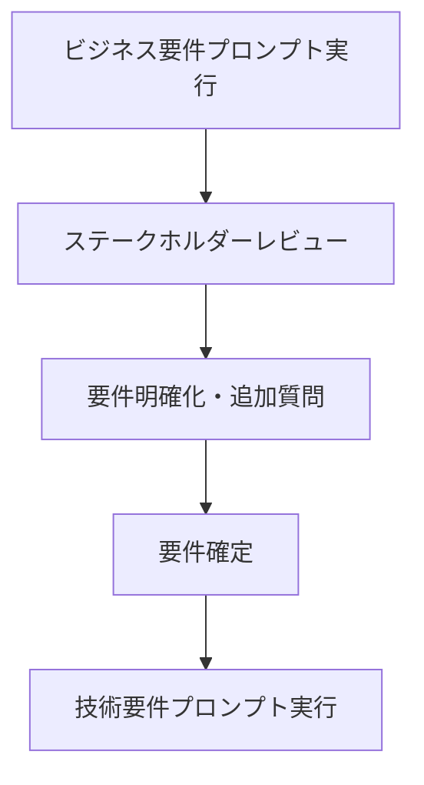
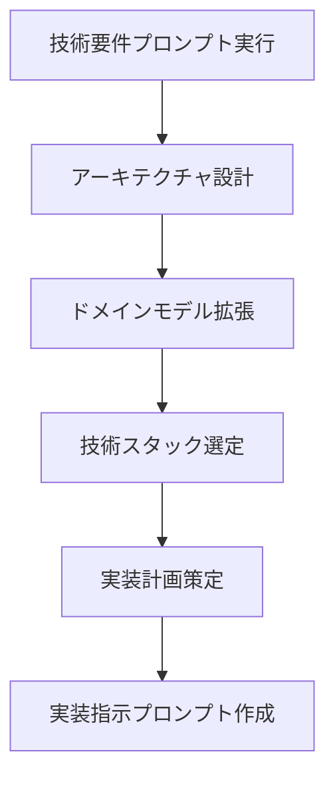
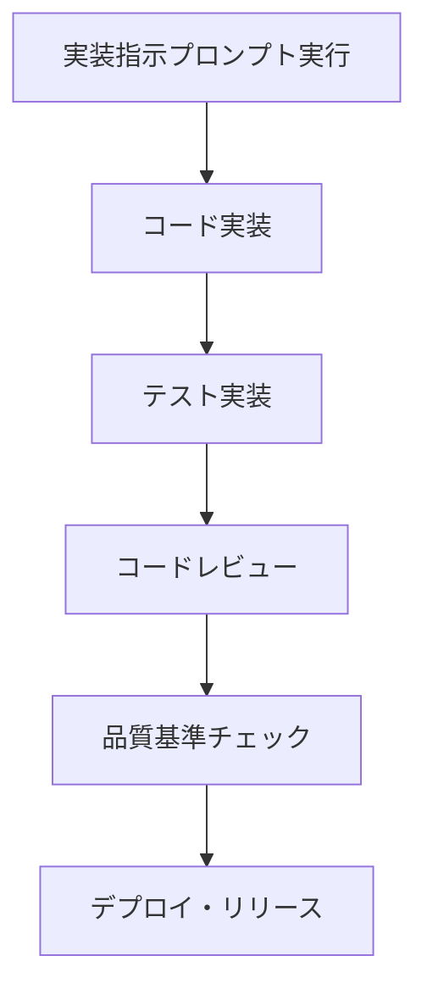

# 要件定義・機能拡張プロンプト設計ガイド

## 📋 概要

本ドキュメントは、Azure Data Factory（ADF）プロジェクトに新機能を追加・拡張する際の要件定義プロセスを標準化し、効率的な開発を支援するプロンプト設計ガイドです。

---

## 🎯 プロンプト設計原則

### 1. 完全性の原則
- 機能要件・非機能要件の両方を含む
- ビジネス価値と技術的制約の明確化
- 受け入れ基準の具体化

### 2. 一貫性の原則
- ドメインモデルとの整合性保証
- 既存アーキテクチャとの適合性検証
- 統一された用語・表現の使用

### 3. 実行可能性の原則
- 実装可能性の事前評価
- リソース・時間制約の考慮
- 段階的実装の可能性

---

## 📝 標準要件定義プロンプトテンプレート

### Phase 1: ビジネス要件定義プロンプト

```markdown
## ビジネス要件定義

**プロジェクト**: Azure Data Factory パイプライン拡張
**要求者**: [ステークホルダー名]
**優先度**: [高/中/低]
**期待効果**: [ビジネス価値の具体的記述]

### 1. ビジネス課題・背景
**現在の課題**:
- [課題1]: [具体的な問題の記述]
- [課題2]: [定量的データがあれば含める]
- [課題3]: [影響範囲とステークホルダー]

**解決すべき問題**:
- [問題の根本原因]
- [現在のワークフローの制約]
- [期待される改善効果]

### 2. 機能要件 (Functional Requirements)
**主要機能**:
- [機能1]: [機能の詳細説明]
  - 入力: [データ形式、ソース]
  - 処理: [変換・計算ロジック]
  - 出力: [結果の形式、宛先]
  
**業務フロー**:
1. [ステップ1]: [具体的なアクション]
2. [ステップ2]: [条件分岐があれば明記]
3. [ステップ3]: [例外処理の要件]

**ユーザーストーリー**:
- As a [ユーザー種別], I want [機能], so that [価値]
- Given [前提条件], When [アクション], Then [期待結果]

### 3. 非機能要件 (Non-Functional Requirements)
**パフォーマンス要件**:
- レスポンス時間: [X秒以内]
- スループット: [Y件/時間]
- 同時実行数: [Z並列]

**可用性要件**:
- 稼働率: [99.X%]
- RTO (目標復旧時間): [X時間]
- RPO (目標復旧地点): [Yデータ]

**セキュリティ要件**:
- データ暗号化: [方式]
- アクセス制御: [認証・認可]
- 監査ログ: [取得レベル]

### 4. 制約・前提条件
**技術制約**:
- [既存システムとの連携制約]
- [使用可能技術スタック]
- [リソース制限]

**ビジネス制約**:
- [予算制限]
- [スケジュール制約]
- [法的・規制要件]

### 5. 受け入れ基準 (Acceptance Criteria)
**機能受け入れ基準**:
- [ ] [テスト可能な条件1]
- [ ] [測定可能な基準2]
- [ ] [確認可能な結果3]

**品質受け入れ基準**:
- [ ] 単体テストカバレッジ: 90%以上
- [ ] E2Eテスト: 全シナリオ成功
- [ ] パフォーマンステスト: 要件達成
```

### Phase 2: 技術要件定義プロンプト

```markdown
## 技術要件定義・設計指示プロンプト

**前提**: [Phase 1で定義されたビジネス要件を参照]

### 1. アーキテクチャ設計指示
**ドメインモデル拡張**:
```
既存のドメインモデル（docs/DOMAIN_DRIVEN_DESIGN_MODEL.md）を基に、
新機能 "[機能名]" に必要な以下の要素を設計してください：

1. **新規境界づけられたコンテキスト**の必要性評価
   - 既存コンテキスト内での実装可能性
   - 新規コンテキスト作成の妥当性
   - コンテキスト間の連携方法

2. **ドメインオブジェクト設計**:
   - 集約ルート: [候補となるエンティティ]
   - エンティティ: [状態を持つオブジェクト]
   - 値オブジェクト: [不変の値]
   - ドメインサービス: [ビジネスロジック]

3. **ドメインイベント設計**:
   - 発行すべきイベント: [イベント名と発生条件]
   - イベントペイロード: [含まれるデータ]
   - イベント処理: [購読者と処理内容]
```

### 2. 実装方針指示
**コード構造**:
```
以下の既存構造に従って、新機能を実装してください：

┌── src/dev/                    # ADF定義
│   ├── pipeline/              # パイプライン定義
│   ├── dataset/               # データセット定義
│   └── linkedService/         # リンクサービス定義
├── tests/                     # テストコード
│   ├── unit/                  # 単体テスト
│   ├── e2e/                   # E2Eテスト
│   └── fixtures/             # テストデータ
└── docs/                      # ドキュメント

**実装要件**:
1. **パイプライン設計**:
   - パイプライン名: [命名規則に従った名前]
   - 活動構成: [Copy Activity, Execute Pipeline等]
   - 依存関係: [既存パイプラインとの関係]

2. **テスト設計**:
   - 単体テスト: tests/unit/test_[機能名].py
   - E2Eテスト: tests/e2e/test_e2e_[機能名].py
   - テストデータ: tests/fixtures/[機能名]_data.py

3. **設定管理**:
   - 環境別設定: [dev/staging/prod]
   - パラメータ化: [外部化すべき設定値]
   - 秘匿情報: [Key Vault使用方針]
```

### 3. 品質要件指示
**コード品質**:
```
以下の品質基準を満たす実装を行ってください：

1. **テストカバレッジ**:
   - 単体テスト: 90%以上
   - E2Eテスト: 主要シナリオ100%
   - 統合テスト: 外部システム連携

2. **コード品質**:
   - Pythonコーディング規約: PEP 8準拠
   - 型ヒント: 必須
   - ドキュメント文字列: Google Style

3. **セキュリティ**:
   - 認証情報のハードコード禁止
   - SQLインジェクション対策
   - ログでの機密情報出力禁止
```

### 4. デプロイ・運用要件
**CI/CD統合**:
```
以下のCI/CDプロセスに統合してください：

1. **自動テスト**:
   - プルリクエスト時: 単体テスト実行
   - マージ時: E2Eテスト実行
   - リリース時: 統合テスト実行

2. **デプロイメント**:
   - 開発環境: 自動デプロイ
   - ステージング環境: 承認後デプロイ
   - 本番環境: 手動デプロイ

3. **監視・運用**:
   - ログ出力: 構造化ログ
   - メトリクス: Prometheus形式
   - アラート: 異常時通知
```
```

### Phase 3: 実装指示プロンプト

```markdown
## 実装指示プロンプト

**対象機能**: [機能名]
**実装者**: [開発者名]
**期限**: [実装期限]

### 1. 実装順序指示
```
以下の順序で実装を進めてください：

1. **ドメインモデル実装** (1-2日)
   - エンティティクラス作成
   - 値オブジェクト実装
   - ドメインサービス実装
   - 単体テスト作成

2. **インフラストラクチャ実装** (2-3日)
   - リポジトリ実装
   - 外部サービス連携
   - 設定管理実装

3. **アプリケーションサービス実装** (1-2日)
   - ユースケース実装
   - アプリケーションサービス
   - API エンドポイント

4. **ADF パイプライン実装** (2-3日)
   - パイプライン定義作成
   - データセット定義
   - リンクサービス設定

5. **テスト実装** (2-3日)
   - E2Eテスト作成
   - 統合テスト作成
   - パフォーマンステスト

6. **ドキュメント更新** (1日)
   - API ドキュメント
   - 運用手順書
   - トラブルシューティング
```

### 2. 実装詳細指示
**コーディング指針**:
```python
# 実装例テンプレート

# 1. エンティティ実装例
@dataclass
class [EntityName]:
    """[エンティティの説明]"""
    
    def __init__(self, entity_id: [EntityId], ...):
        self.entity_id = entity_id
        self._domain_events: List[DomainEvent] = []
    
    def [business_method](self, ...) -> None:
        """[ビジネスメソッドの説明]"""
        # ビジネスルール検証
        self._validate_business_rule()
        
        # 状態変更
        self._update_state()
        
        # ドメインイベント発行
        self._add_domain_event([DomainEvent](...))

# 2. アプリケーションサービス実装例
class [FeatureName]ApplicationService:
    """[機能名]のアプリケーションサービス"""
    
    def __init__(self, repository: [Repository], ...):
        self.repository = repository
    
    @transactional
    def execute_[use_case](self, command: [Command]) -> [Result]:
        """[ユースケース名]"""
        # 1. 入力検証
        self._validate_command(command)
        
        # 2. ドメインオブジェクト取得
        entity = self.repository.find_by_id(command.entity_id)
        
        # 3. ビジネスロジック実行
        result = entity.[business_method](...)
        
        # 4. 永続化
        self.repository.save(entity)
        
        # 5. イベント発行
        self._publish_events(entity.domain_events)
        
        return result
```

### 3. テスト実装指示
**テストケース設計**:
```python
# E2Eテスト実装例
class TestE2E[FeatureName]:
    """[機能名]のE2Eテスト"""
    
    @pytest.fixture
    def test_data(self):
        """テストデータセットアップ"""
        return {
            'input_data': [...],
            'expected_output': [...],
            'test_parameters': {...}
        }
    
    def test_[scenario_name](self, test_data):
        """[シナリオ名]のテスト"""
        # Given: 前提条件セットアップ
        setup_test_environment(test_data)
        
        # When: アクション実行
        result = execute_pipeline('[pipeline_name]', test_data['input_data'])
        
        # Then: 結果検証
        assert result.status == 'SUCCESS'
        assert result.output == test_data['expected_output']
        
        # And: 副作用確認
        verify_side_effects()
```

### 4. 完了基準チェックリスト
**実装完了基準**:
- [ ] ドメインモデル実装完了
- [ ] 単体テスト90%以上のカバレッジ
- [ ] E2Eテスト全シナリオ成功
- [ ] コードレビュー完了
- [ ] ドキュメント更新完了
- [ ] CI/CDパイプライン統合完了

**品質確認基準**:
- [ ] 静的解析エラーなし
- [ ] セキュリティスキャン通過
- [ ] パフォーマンステスト基準達成
- [ ] ログ出力適切性確認
- [ ] エラーハンドリング適切性確認
```

---

## 🔄 プロンプト実行フロー

### 1. 要件収集フェーズ


### 2. 設計フェーズ


### 3. 実装フェーズ


---

## 📊 プロンプト品質評価指標

### 完全性指標
- **要件網羅率**: 必要な要件項目の記述率
- **受け入れ基準明確度**: テスト可能な基準の具体性
- **制約条件記述率**: 技術・ビジネス制約の明示度

### 実行可能性指標
- **実装可能性**: 技術的実現可能性の評価
- **工数見積もり精度**: 実際の工数との差異
- **品質基準達成率**: 設定した品質基準の達成度

### 一貫性指標
- **ドメインモデル整合性**: 既存モデルとの整合度
- **アーキテクチャ適合性**: 既存アーキテクチャとの適合度
- **コーディング規約遵守率**: 設定した規約の遵守度

---

## 🛠️ プロンプトカスタマイズガイド

### ドメイン特化カスタマイズ
```markdown
## [特定ドメイン]向けカスタマイズ例

### データ品質ドメイン拡張の場合
**追加要件項目**:
- データ品質ルール定義
- 異常検知アルゴリズム選択
- 品質メトリクス定義
- ダッシュボード要件

### パイプライン実行ドメイン拡張の場合
**追加要件項目**:
- 依存関係管理方式
- エラーハンドリング戦略
- リトライ・回復ロジック
- パフォーマンス最適化要件
```

### 複雑度レベル別カスタマイズ
```markdown
## 複雑度レベル別プロンプト調整

### 低複雑度（既存機能の小修正）
- 簡略化されたプロンプト使用
- ビジネス要件中心
- 実装指示の詳細化

### 中複雑度（新機能追加）
- 標準プロンプトテンプレート使用
- ドメインモデル拡張検討
- 段階的実装計画

### 高複雑度（アーキテクチャ変更）
- 詳細プロンプト使用
- 影響範囲分析必須
- リスク評価・軽減策検討
```

---

## 📚 関連ドキュメント

- [ドメイン駆動設計モデル](./DOMAIN_DRIVEN_DESIGN_MODEL.md)
- [アーキテクチャ設計仕様書](./ARM_TEMPLATE_DESIGN_SPECIFICATION.md)
- [要件定義書](./ARM_TEMPLATE_REQUIREMENTS_DEFINITION.md)
- [テスト戦略ドキュメント](./TEST_STRATEGY_DOCUMENT.md)

---

**更新日**: 2025年7月5日  
**作成者**: 要件定義標準化チーム  
**承認者**: プロジェクトマネジメントオフィス
