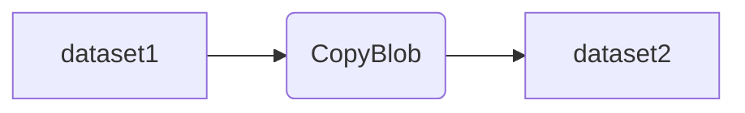

# ADFパイプラインフロー図

このドキュメントは、Azure Data Factory (ADF) のパイプラインフローをMermaid記法で図示し、仕様を説明します。

## フロー図

## 仕様

- **dataset1**  
  コピー元となるデータセット。Blobストレージやデータベースなど任意のデータソースを指定可能。

- **CopyBlob**  
  データコピーアクティビティ。`dataset1`から`dataset2`へデータを転送します。  
  必要に応じてマッピングや変換も設定可能。

- **dataset2**  
  コピー先となるデータセット。Blobストレージやデータベースなど任意のデータシンクを指定可能。

---

> Mermaid記法のプレビューには、VSCode拡張機能「Markdown Preview Mermaid Support」や「Markdown Preview Enhanced」が必要です。
