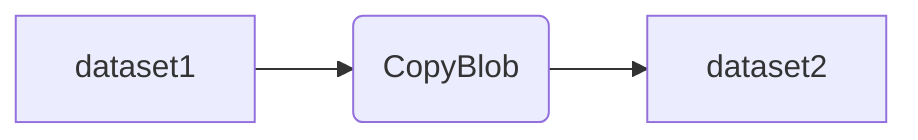

# データファクトリーパイプラインフロー

このドキュメントでは、Azure Data Factory (ADF) のパイプラインの処理の流れをMermaid記法を用いてわかりやすく解説します。

## 処理フロー

## 処理内容

- **dataset1**  
  データのコピー元となるデータセットです。Blobストレージやデータベースなど、様々なデータソースを指定できます。

- **CopyBlob**  
  データをコピーするアクティビティです。`dataset1`から`dataset2`へデータを転送します。  
  必要に応じて、データの形式変換や加工も行えます。

- **dataset2**  
  データのコピー先となるデータセットです。Blobストレージやデータベースなど、様々なデータシンクを指定できます。

---

> Mermaid記法の表示には、VSCode拡張機能「Markdown Preview Mermaid Support」または「Markdown Preview Enhanced」が必要です。
