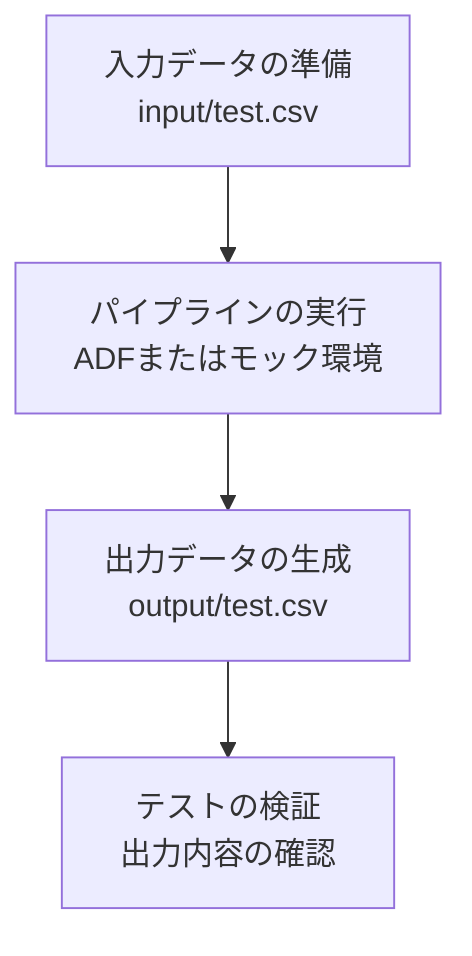

# ジョブフロー概要



## 1. 入力データの準備
- `input` フォルダにCSVファイル（例: `test.csv`）を配置

## 2. パイプラインの実行
- Azure Data Factory (ADF) またはモック環境でパイプライン（例: `pipeline1.json`）を実行
- 入力ファイルを読み込み、処理を実施

## 3. 出力データの生成
- 処理結果を `output` フォルダにCSVファイルとして出力

## 4. テストの流れ
1. テストデータを `input` フォルダに作成
2. パイプラインを実行
3. `output` フォルダに出力ファイルが生成されているか確認
4. 出力ファイルの内容が期待通りか検証

---

## フォルダ構成例

```
azureDevOps/
├── input/
│   └── test.csv
├── output/
│   └── test.csv
├── tests/
│   └── run_tests.py
└── job_flow.md
```

---

## 注意事項
- テスト実行時は `input` および `output` フォルダが自動生成されます。
- 出力ファイルはテスト後に自動削除されます。
