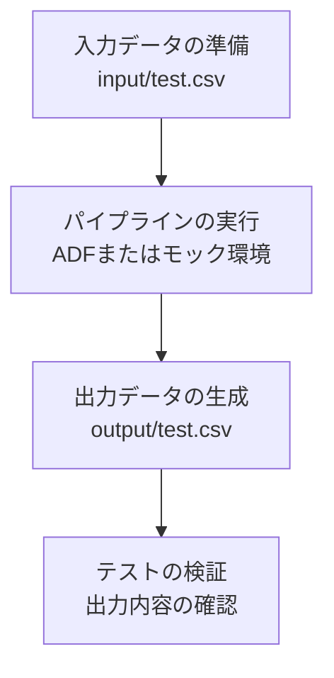

# テスト環境構築手順

このドキュメントでは、テスト環境の構築手順について説明します。

## 処理の流れ



## 1. 事前準備
- `input` フォルダにテストデータ（CSVファイルなど）を配置します。

## 2. パイプラインの実行
- Azure Data Factory (ADF) またはモック環境でパイプライン（`pipeline1.json`など）を実行します。
- 入力ファイルを読み込み、データ処理を行います。

## 3. 結果の確認
- 処理結果が `output` フォルダにCSVファイルとして出力されていることを確認します。

## 4. テストの実施
1. `input` フォルダにテストデータを作成します。
2. パイプラインを実行します。
3. `output` フォルダに出力ファイルが生成されていることを確認します。
4. 出力ファイルの内容が期待どおりであることを検証します。

---

## ディレクトリ構成

```
azureDevOps/
├── input/
│   └── test.csv
├── output/
│   └── test.csv
├── tests/
│   └── run_tests.py
└── test_environment_setup.md
```

---

## 補足事項
- テスト実行時には、`input` および `output` フォルダが自動的に生成されます。
- テスト完了後、出力ファイルは自動的に削除されます。
